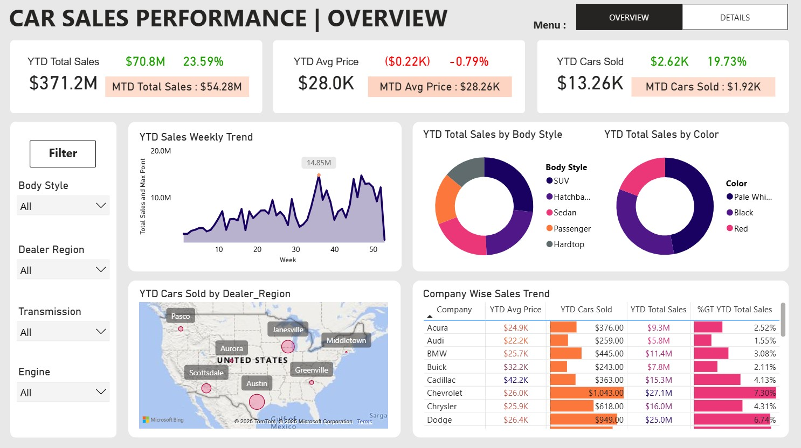
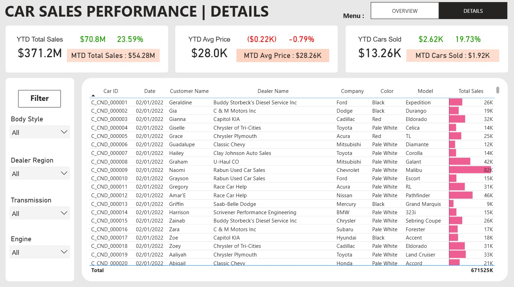

# 🚗 Car Sales Performance Dashboard

## 📚 About Data
This car sales performance dashboard provides in-depth analysis of YTD sales totaling $371.2M, with breakdowns by body style, color, dealer region, and company-wise trends. It includes weekly and geographic sales trends, average price fluctuations, and detailed transaction-level data to monitor market demand, customer behavior, and sales efficiency.

## 💡 Highlights

- YTD Total Sales reached $371.2M, showing a strong growth of 23.59% compared to previous periods.
- YTD Cars Sold totaled 13,260 units, with a 19.73% increase month-to-date sales of 1,920 cars.
- SUVs lead sales by body style, followed by Sedans and Passenger cars, highlighting customer preference trends.
- Chevrolet and Dodge dominate company-wise sales, contributing significantly with 7.3% and 6.74% of total YTD sales respectively.
- Geographical sales distribution shows key hubs like Austin, Janesville, and Scottsdale driving higher sales volumes across regions.

## ✏️ Data Wrangling
Conducted simple data wrangling and data cleaning:

- Removed rows with missing values
- Cleaned Valuation and Funding columns and cast as float
- Exclude rows with "Unknown" Funding values
- Explode Select Investors column into individual rows for categorical analysis

## 📊 Visualization
- Produced a 2-pager dashboard using Power BI.
- Power BI : [Link](https://app.powerbi.com/view?r=eyJrIjoiZDZiODE5Y2QtMjdiZC00YTJmLWI3MTEtOGVlOThhOTRiNjViIiwidCI6ImFjZWQ1ODNlLTRhM2ItNDJkZS05ZTQ0LTRlNWFmYTk5Yjk4YSIsImMiOjEwfQ%3D%3D)

